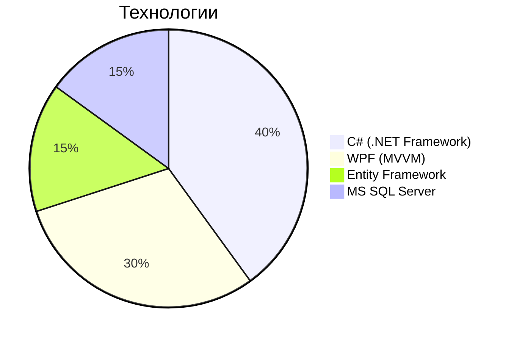

# 🏨 Hotel Management System

Курсовой проект по дисциплине "Разработка программных модулей" — Разработка программных модулей информационной системы для управления отелями.

## 📌 Основной функционал

### 🔑 Администрирование
- Авторизация персонала (роли: администратор, менеджер, горничная)
- Управление учетными записями сотрудников

### 🛏 Управление номерами
- Каталог номеров с фильтрацией (тип, стоимость, статус)
- Визуализация занятости (календарь бронирований)
- Фото и описание номеров

## 🛠 Технологический стек



## Инстукция по запуску
 
### Склонируйте проект и перейдите в него
```bash
git clone https://github.com/akbar-alizhonov/course-work-hotel.git
cd course-work-hotel
```

### Если у вас скачана СУБД MS SQL Server, то можете пропускать этот шаг
- Перейдите по этой ссылке [MS SQL Server](https://www.microsoft.com/en-us/sql-server/sql-server-downloads) и скачайте необходимую версию СУБД
- Или запустите образ в [Docker](https://hub.docker.com/r/microsoft/mssql-server)

### Создание бд
- Название бд обязательно должно быть **Hotels**
- И запустите миграции которые находятся в папке **migrations**

### Соберите приложение и запустите exe-шник
```bash
msbuild HotelSystem.sln /p:Configuration=Release
# После сборки в Release
cd bin\Release
.\HotelSystem.exe
```
